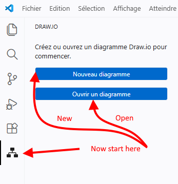

# Draw.io Diagrams Editor


Draw and maintain diagrams without leaving VS Code. This extension embeds the full [Draw.io / diagrams.net](https://app.diagrams.net/) editor — **offline, no browser, no account**.

> Unofficial version with no affiliation, sponsorship or endorsement in any way from draw.io  or diagrams.net.

> Fork of [hediet/vscode-drawio](https://github.com/hediet/vscode-drawio) (GPL-3.0), actively maintained with bug fixes and improvements not yet merged upstream.

---

## Network and privacy

Default behaviour is designed to stay local:

- **Offline mode is enabled by default**. The bundled editor is used locally.
- The extension performs a **version check once every 24 hours** against the GitHub releases API to detect new upstream Draw.io versions.
- This check only stores a local timestamp and the last dismissed version in VS Code state.
- The VS Code extension layer does **not include telemetry or analytics reporting**.

Network access can still occur in these cases:

- If you disable offline mode, the editor loads the configured remote URL, which is `https://embed.diagrams.net/` by default.
- If you configure external resources such as custom library URLs, those resources may trigger additional requests.

See [PRIVACY.md](./PRIVACY.md) for the full privacy notice.

---

## Supported formats

| Extension | Description |
|-----------|-------------|
| `.drawio` / `.dio` | Native XML format, best for version control and diffs |
| `.drawio.svg` | SVG with embedded diagram — renderable on GitHub without export |
| `.drawio.png` | PNG with embedded diagram — same idea, lower quality than SVG |

Just create an empty file with one of these extensions and open it — the editor starts automatically.



---

## Editing diagram and XML side by side

Click the **sheet + arrow** icon in the top-right corner of the editor to open the raw XML alongside the visual editor. Both stay synchronized: edits in one reflect instantly in the other.

This makes bulk renaming, find/replace and scripted edits much faster than working in the visual editor alone.


---

## Code Link

Label any node or edge `#SymbolName`. When **Code Link** is active (toggle in the status bar), double-clicking that node jumps straight to the matching symbol definition in your source code.

Works with any language that supports VS Code workspace symbol search (TypeScript, Python, C#, Java, …).


---

## Themes

Switch themes at any time with the **`Draw.io: Change Theme`** command.

<details>
<summary>Available themes</summary>

| atlas | Kennedy |
|-------|---------|
|  |  |

| min | dark |
|-----|------|
|  |  |

</details>

---

## Commands

| Command | Description |
|---------|-------------|
| `Draw.io: Convert To…` | Convert a diagram to another format |
| `Draw.io: Export To…` | Export to PNG, SVG, PDF, … |
| `Draw.io: Change Theme` | Switch the editor theme |
| `Draw.io: Toggle Code Link Activation` | Enable/disable the Code Link feature |

---

## Associate plain `.svg` files with the editor

By default only `*.drawio.svg` files open in this editor. To handle all `.svg` files, add to `settings.json`:

```json
"workbench.editorAssociations": {
    "*.svg": "electropol-fr.drawio-diagrams-editor-text"
}
```

Only Draw.io-generated SVGs can be edited this way — arbitrary SVG files are not supported.

---

## What changed in this fork

- Activity bar panel with i18n support (🇫🇷 French / 🇬🇧 English)
- Button to open XML source beside the diagram (no need for `View: Reopen Editor With…`)
- SVG export fix
- Updated to Draw.io v29+ (new shape libraries, `math4` format)
- Ongoing bug fixes not yet merged in the original project

---

## Credits

- **Frank Sauret** — fork maintainer ([GitHub](https://github.com/FrankSAURET))
- **Henning Dieterichs** — original author ([hediet/vscode-drawio](https://github.com/hediet/vscode-drawio))
- **Vincent Rouillé** — contributor ([Speedy37](https://github.com/Speedy37))